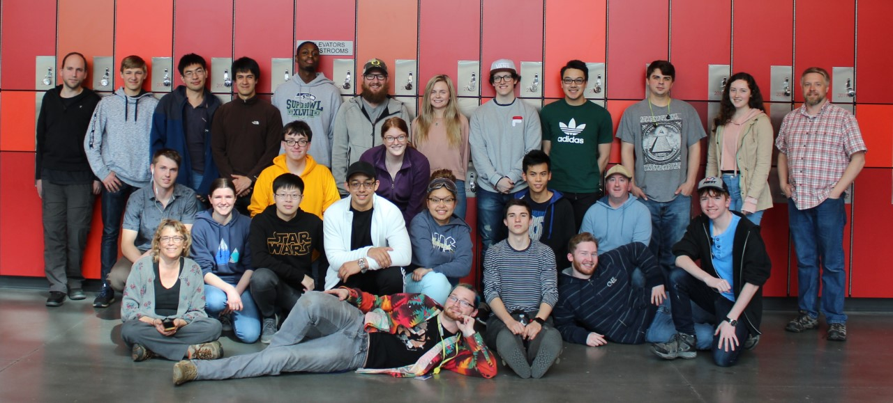
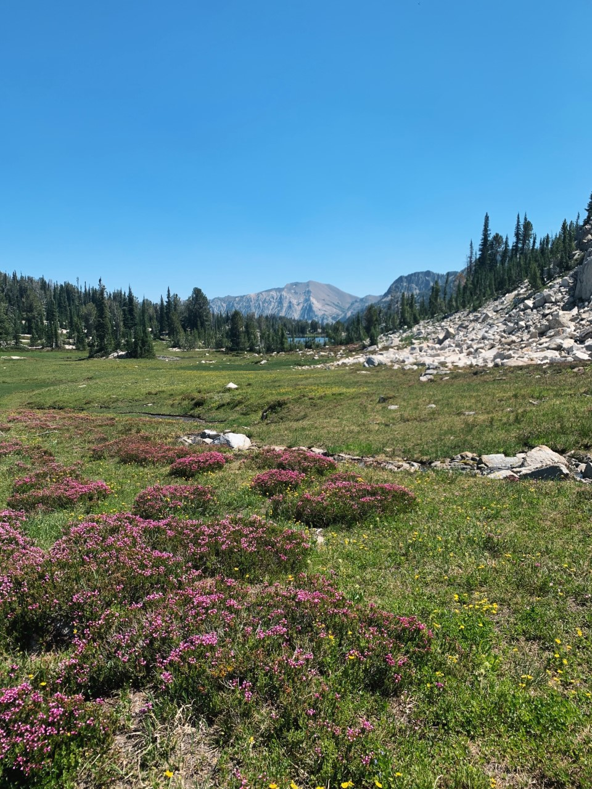

```{r setup, include=FALSE}
knitr::opts_chunk$set(echo = TRUE)
```


## Who are you?

To answer the question this question is a significant undertaking, and even sitting here reflecting I find myself pulling seemingly meaningless events as things that has inspired who I am as a person. If I had to keep this short and describe myself in a few words, here is what I would say: **persistent, empathetic, perceptive, perfectionistic, assertive.** Luckily, I don’t have to describe myself in 5 words, but rather 1,500, so this gives me a chance to outline some of the things that have made me who I am. 

At nine years old, I packed up my life with my sister and mom and moved to Spain. My mom is a civil engineer at Boeing and was sent to work for one of their suppliers for a year. Looking back, when my mom asked if I wanted to move to Spain and I quickly answered yes, I had no idea what I was getting myself into. I don’t think I knew how hard it would be to learn a language, a place, and a culture all at once. The city we were in, Bilbao, was about an hour from the nearest “American School” and so, thankfully, I attended a school that was not catered to someone like me. This was hard, but I am so glad I didn’t stay in the little box that defined me as “American” and was willing to immerse myself in a different culture. My first day was the most nervous I have ever been, I genuinely knew about 50 words total and probably three sentences. Slowly, I became comfortable and after only three months, I was completely fluent. This telling of the story skips over the hard parts and the struggles, but I saw with my own two eyes that just because you are uncomfortable does not mean you aren’t in the right place. In my life thus far, the experience in Spain has been the biggest sign that challenges can be faced head on, and results can be reached. There are so many other things from there that made me who I am, but I’ll suffice it to say that Spain holds such a special place in my heart, and I am so thankful for a culture shift at such a young age. 

Understanding and experiencing a culture much different than that of the United States has made me more tolerant and empathetic. I try to recognize that not everyone thinks the same way I do, not just culturally but in general. When I get in arguments, I want to understand the other person’s side. It doesn’t mean I think they are right but that I want to know why they think the way they do. When deciding what to do after high school, it felt right for me to pursue Psychology. I had aced my AP exam, and everything just clicked. I attended the University of Portland for a semester, where I took junior level psychology courses. I loved the subject, but I didn’t feel challenged and I also hated the small, private school culture. I dropped out and changed majors, but I still carry the knowledge with me because understanding people and their motives is relevant in almost any situation, even engineering.  


Years ago, I never would’ve guessed that the word **perfectionistic** could be used to describe me. More and more though, I see myself fitting into that box and filling that role. For a lot of my life, I excelled at the things I chose to do: soccer, AP classes, track and field. Classes got harder and soccer got more competitive, but I was still able to succeed. Now, I feel like I must succeed at any cost, mostly to myself. I have spent years likely overworking myself between school, work, and hobbies but it has always felt worth it. Combining persistent, perfectionistic, and assertive seems like a great way to find yourself with a lot of work on your plate, but with a promise that it will get done and it will be great. 

I have been having the word **aggressive** thrown at me since before I was old enough to know what it meant. That’s not to say that it wasn’t warranted, just that it seemed to be part of my character at a young age. My grandma will tell you that I smashed my head so hard on her face that I broke her nose, but that it was how I showed my love at age 2. As I grew up, I was always getting in trouble for hitting my friend or kicking a kid who made me mad at recess. My aggression was two-fold: sometimes I used it to showcase my anger, and other times, my love. At 22, my self-descriptor of **assertive** fits into different aspects of my life. I have taught myself to take anger out in other ways besides for hitting; but I have maintained my ability to express it, nonetheless. I am honest in my feelings and open in asking for what I want. I will often take control in a situation if I feel as though nothing is getting accomplished or if I can help contribute to goal completion; this explains why I am the president of Engineering Club, the Director of Legislative Affairs for WSU Everett’s student government, and why I have taken the lead on most group projects in my time at university. I know that I can handle a challenge and that I can get good results with the effort I put in. For someone who is constantly busy, I keep somehow finding new things to add to the plate and I wouldn’t have it any other way. I like to feel productive and in control. 


## Where are you? Why are you there?

Right now, I feel like I am both at the end and the beginning of an adventure. Life will change so significantly after graduation, and maybe not in shocking ways, but maybe in more discrete ways. The past four years of college have been difficult and often frustrating, but I have found a routine among class schedules and work and friends. The adventure that will begin is terrifying to me because there are so many paths that life could take, and every decision and every choice will affect those paths. For some reason, I find myself living in a place of fear because I so badly want to make the perfect decision. Of course, there is no perfect decision, but I convince myself that if I look hard enough, I will find it. I also am thrilled to begin my own journey and find independence along the way and feel antsy to move on from where I am now. It is odd to be pulled between two differing emotions in this way. 

Even with all the frustrations and difficulties, I am in a place where I feel grateful. I am grateful to the family and friends who have truly helped me get this far in college. I am grateful for all the professors who have inspired me, whether they know it or not. And last, I am grateful for myself for working so hard at something I used to not believe I was capable of accomplishing. 

## Where do you want to go?

When I think about where I want to go, I realize that all of the innocent childhood dreams seem to have fallen away. My mind does not go to some impossible reality that might bring me joy, but to some career and life that I can work for. Seeing as my graduation from college is becoming more and more imminent, I have spent an increasing amount of time weighing my options. I would like to continue on in school after I receive my bachelor’s degree. If I were to attend graduate school, my area of interest would be thermodynamics, motorsports engineering, or nuclear engineering. All of these seem quite different and would certainly take me on diverging paths, but they all have something in common. They all somehow involve heat transfer and the study of improving a system through improvement of its governing principles. I thoroughly enjoy theoretical learning and the math beyond common principles. The degree I am getting is in Mechanical Engineering and I love the interplay of components and creating systems from them. My niche, however, is not necessarily design work or creating new machines; I would rather analyze and improve on an existing design.

In the past year with the pandemic, I feel as though I have become jaded with school and weighed down with worries and stress. If I were to entertain those seemingly impossible childhood dreams, I would say that I want to work in a wood shop and create something different, something not assigned to me, but something that feels beautiful. I would say that I want to learn how to fly a plane and roam the world. I want to travel all over and really experience different cultures. This is simply to say that I know the world is more than numbers and data and that it is beautiful and odd, and I hope to get to experience all parts of it in my time. 


